# Git

## 1. Git介绍

1.1 什么是Git?


​	  Git(读音为/gɪt/。)是一个开源的分布式版本控制系统，可以有效、高速地处理从很小到非常大的项目版本管理。Git 是 Linus Torvalds 为了帮助管理 Linux 内核开发而开发的一个开放源码的版本控制软件。

1.2 Git历史

​	   同生活中的许多伟大事件一样，Git 诞生于一个极富纷争大举创新的年代。Linux 内核开源项目有着为数众广的参与者。绝大多数的 Linux 内核维护工作都花在了提交补丁和保存归档的繁琐事务上（1991－2002年间）。到 2002 年，整个项目组开始启用分布式版本控制系统 BitKeeper 来管理和维护代码。

​	  到 2005 年的时候，开发 BitKeeper 的商业公司同 Linux 内核开源社区的合作关系结束，他们收回了免费使用 BitKeeper 的权力。这就迫使 Linux 开源社区（特别是 Linux的缔造者 Linus Torvalds ）不得不吸取教训，只有开发一套属于自己的版本控制系统才不至于重蹈覆辙。他们对新的系统订了若干目标：

+ 速度

+ 简单的设计

+ 对非线性开发模式的强力支持（允许上千个并行开发的分支）

+ 完全分布式

+ 有能力高效管理类似 Linux 内核一样的超大规模项目（速度和数据量）

  

## 2. Git与svn对比

#### 2.1 svn

​	SVN是集中式版本控制系统，版本库是集中放在中央服务器的，而干活的时候，用的都是自己的电脑，所以首先要从中央服务器哪里得到最新的版本，然后干活，干完后，需要把自己做完的活推送到中央服务器。集中式版本控制系统是必须联网才能工作，如果在局域网还可以，带宽够大，速度够快，如果在互联网下，如果网速慢的话，就郁闷了。

下图就是标准的集中式版本控制工具管理方式：

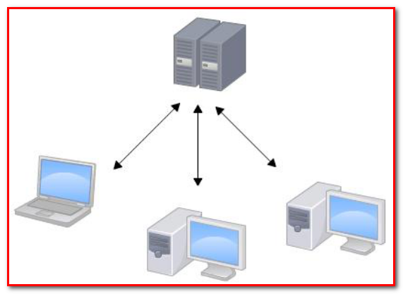

​	集中管理方式在一定程度上看到其他开发人员在干什么，而管理员也可以很轻松掌握每个人的开发权限。

但是相较于其优点而言，集中式版本控制工具缺点很明显：

+ 服务器单点故障
+ 容错性差

存储文件的方式：记录文件的差异。

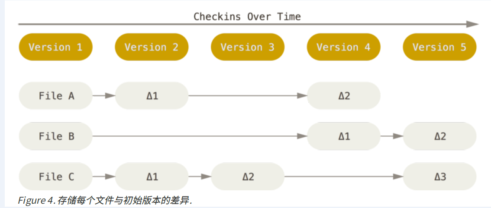


#### 2.2 git

​	Git是分布式版本控制系统，那么它就没有中央服务器的，每个人的电脑就是一个完整的版本库，这样，工作的时候就不需要联网了，因为版本都是在自己的电脑上。既然每个人的电脑都有一个完整的版本库，那多个人如何协作呢？比如说自己在电脑上改了文件A，可以将文件A提交到本地版本库；其他人也在电脑上改了文件A，也可以将文件A提交到自己的本地版本库，这时，你们俩之间只需把本地版本库的内容各自的修改推送给对方（使用共享版本库，例如github、码云...），就可以互相看到对方的修改了。

​	下图就是分布式版本控制工具管理方式：

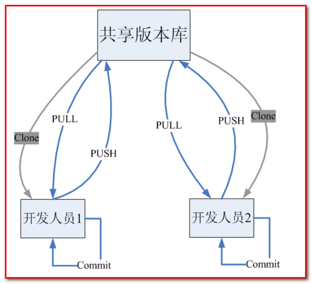


存储文件的方式：记录文件的快照（整个文件）

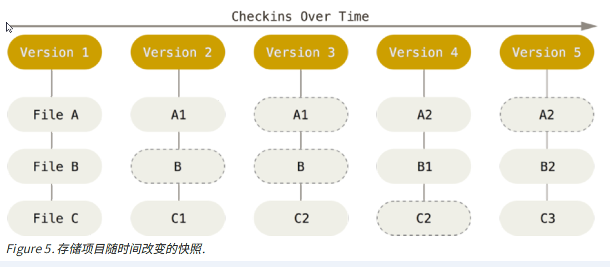


### 2.3 Git的工作流程

一般工作流程如下：

1．从远程仓库中克隆 Git 资源作为本地仓库。

2．从本地仓库中checkout代码然后进行代码修改

3．在提交前先将代码提交到暂存区。

4．提交执行commit命令。提交到本地仓库。本地仓库中保存修改的各个历史版本。

5．在修改完成后，需要和团队成员共享代码时，可以将本地仓库的代码push到远程仓库。

下图展示了 Git 的工作流程：

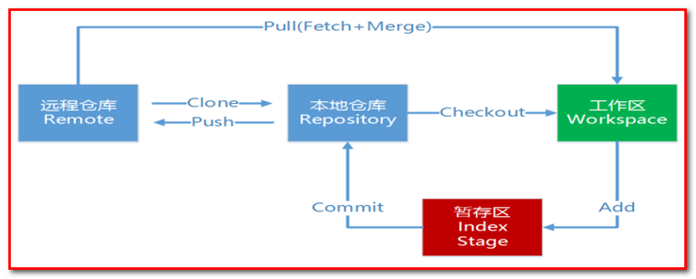

注意：

Git 有三种状态，你的文件可能处
于其中之一：已提交（committed）、已修改（modified）和已暂存（staged）


## 第三章-Git的安装

​	最早Git是在Linux上开发的，很长一段时间内，Git也只能在Linux和Unix系统上跑。不过，慢慢地有人把它移植到了Windows上。现在，Git可以在Linux、Unix、Mac和Windows这几大平台上正常运行了。由于开发机大多数情况都是windows，所以本教程讲解windows下的git的安装及使用。

### 1. 软件下载

+ 下载地址：[https://git-scm.com/download](https://git-scm.com/download)

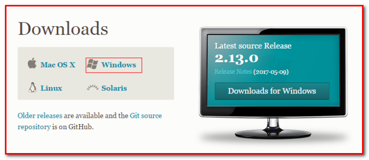


### 2.软件安装

#### 2.1安装 git for windows

如图所示使用64位。

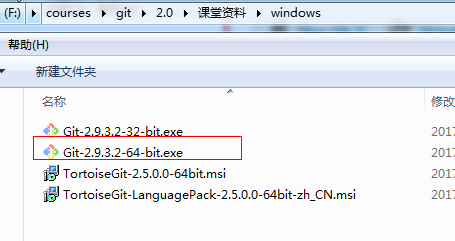


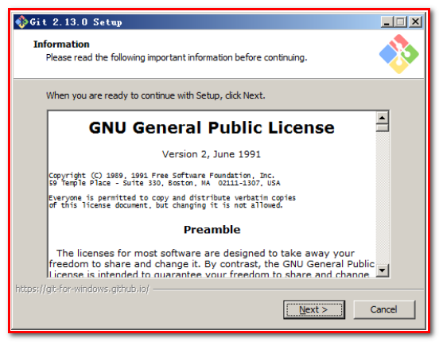

一路“下一步”使用默认选项即可。(默认安装在c盘)

判断是否安装成功，输入 `git --version`


或者右击鼠标，出现，如图所示表示已经安装成功。

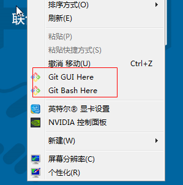


#### 2.2安装TortoiseGit

如图所示：双击安装小乌龟（TortoiseGit）。

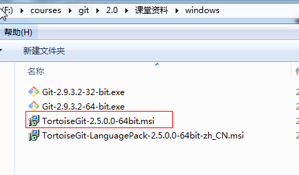


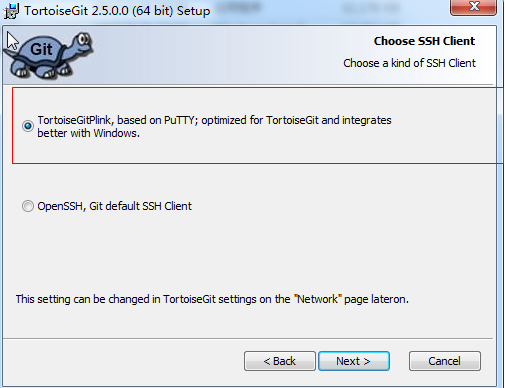

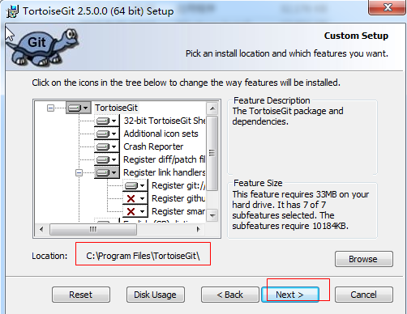

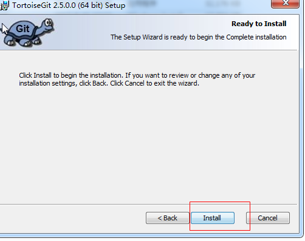


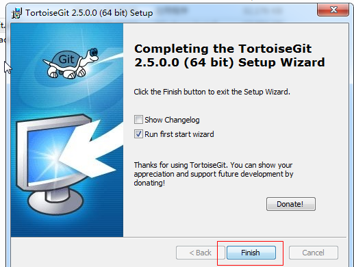


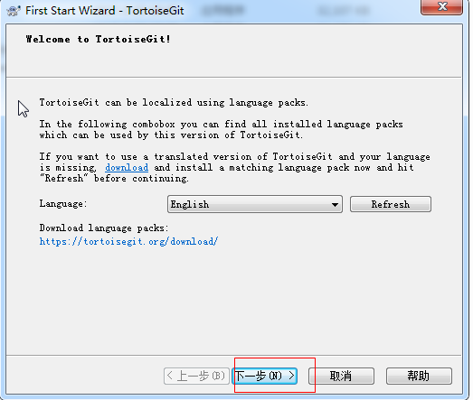

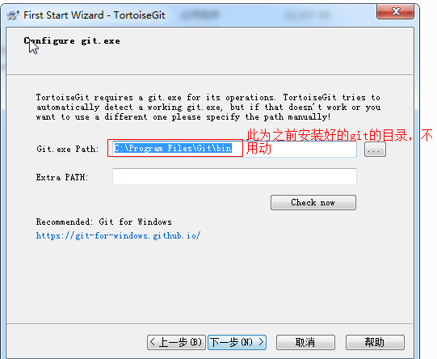

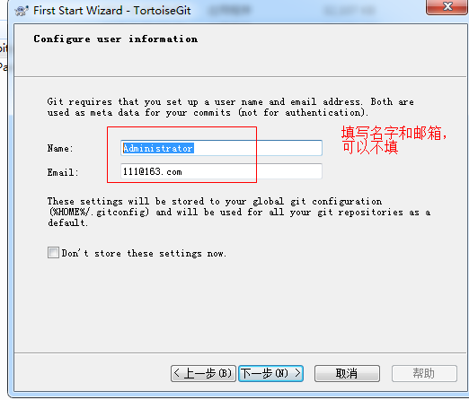


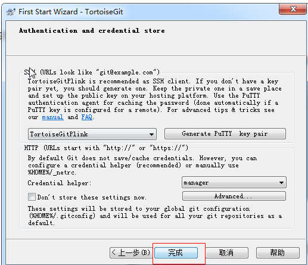


完整完毕后在系统右键菜单中会出现git的菜单项

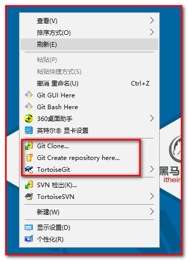


安装完成后，查看机器的用户和email,就是刚才填写的用户名和邮箱。


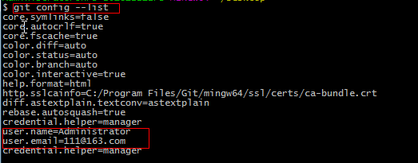


#### 2.3安装中文语言包

安装中文语言包并不是必选项。可以根据个人情况来选择安装。

安装如下所示的中文语言包。（一定要先安装git,再安装语言包，让其支持中文）

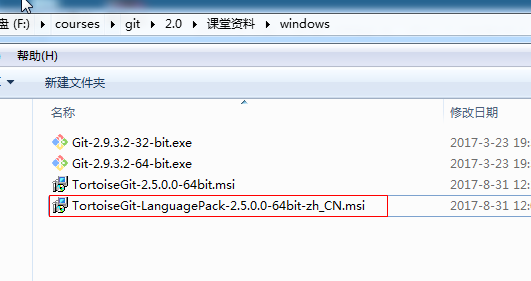

安装完成后，最好重启电脑。


设置语言为中文：选中中文即可。

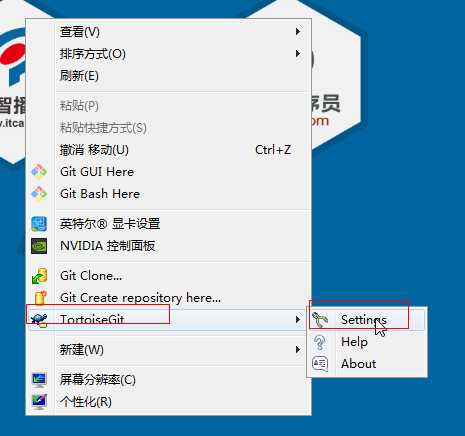

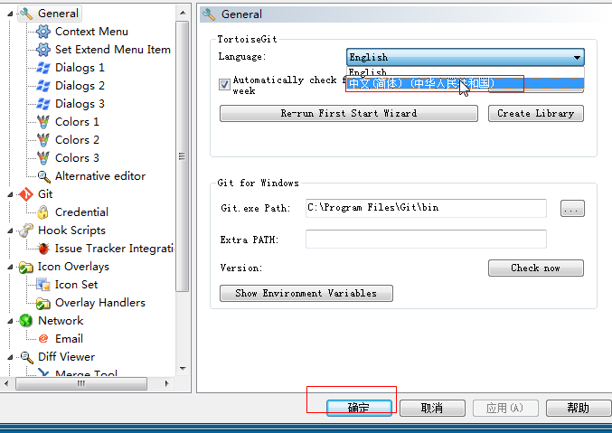


## 4. 使用git管理文件版本

### 1.创建版本库

#### 1.1使用GitBash

+ 创建repo01目录

  

+ 进入repo01目录, 右键点击Git Bash Here

  ​

  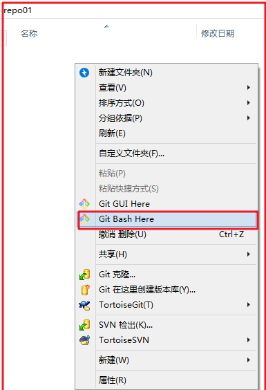

  ​

+ 输入命令  `git init`

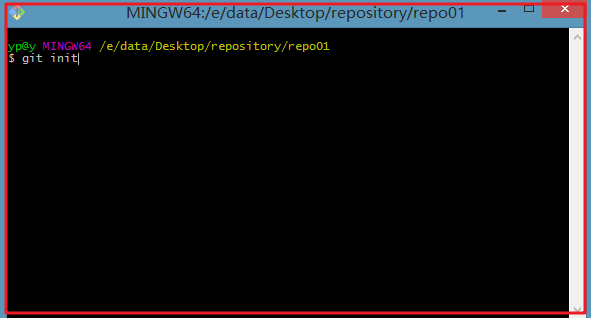

+ 版本库创建成功，会在此目录下创建一个.git的隐藏目录（叫做版本库），如下所示

  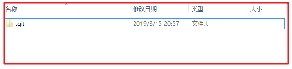


#### 1.2使用TortoiseGit

+ 使用TortoiseGit时只需要在目录中点击右键菜单选择“在这里创建版本库”

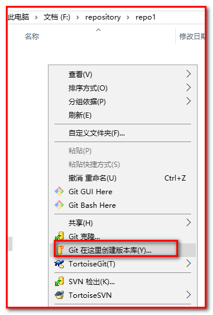


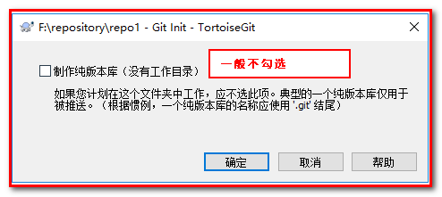

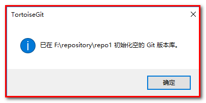

+ 版本库创建成功，会在此目录下创建一个.git的隐藏目录（叫做版本库），如下所示

  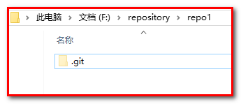

  注:在windows中如何显示隐藏目录

  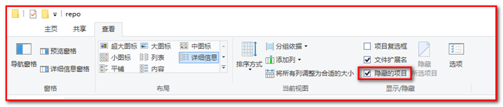

  ​

#### 1.3概念

+ 版本库：.git目录就是版本库，将来文件都需要保存到版本库中。
+ 工作目录（工作区）：包含“.git”目录的目录，也就是.git目录的上一级目录就是工作目录。只有工作目录中的文件才能保存到版本库中。

### 2.添加文件

#### 2.1添加文件过程

+ 在仓库目录下创建一个mytest.txt文件

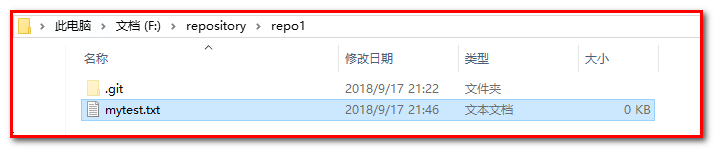

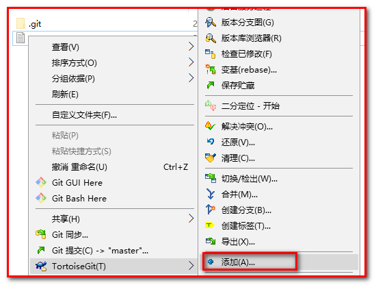


+ 文本文件变为带“+”号的图标

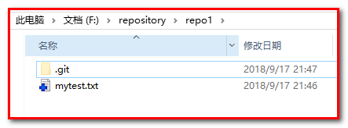

+ 提交文件：在mytest.txt上再次点击右键选择“提交”，此时将文件保存至版本库中

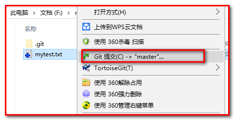

+ 填写日志

  ​

  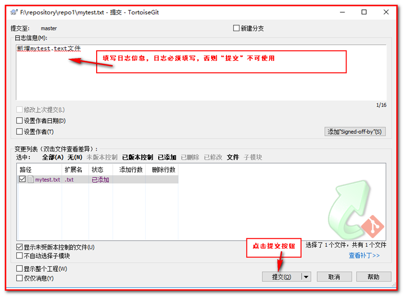


+ 提交成功

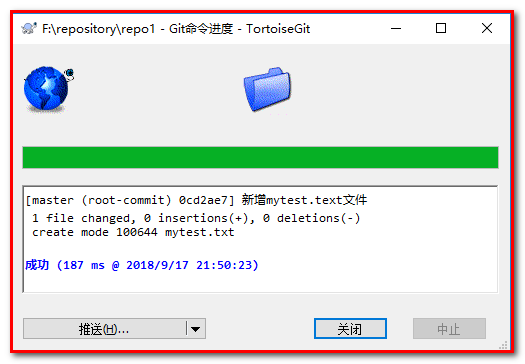

+ 查看文件

  ​

  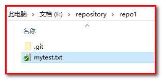

#### 2.2工作区和暂存区

Git和其他版本控制系统如SVN的一个不同之处就是有暂存区的概念。

+ 什么是工作区（Working Directory）？

  ​工作区就是你在电脑里能看到的目录，比如我的reporstory文件夹就是一个工作区。

+ 什么是版本库？

  ​在这个工作区目录中的“.git”隐藏文件夹是版本库。

  ​Git的版本库里存了很多东西，其中最重要的就是称为stage（或者叫index）的暂存区，还有Git为我们自动创建的第一个分支master，以及指向master的一个指针叫HEAD。

  ​如下图所示：

  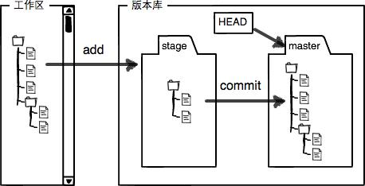分支和HEAD的概念我们稍后再讲。前面讲了我们把文件往Git版本库里添加的时候，是分两步执行的：

```
第一步是用git add把文件添加进去，实际上就是把文件修改添加到暂存区；
第二步是用git commit提交更改，实际上就是把暂存区的所有内容提交到当前分支（默认是master）。
```

​	因为我们创建Git版本库时，Git自动为我们创建了唯一一个master分支，所以，现在，git commit就是往master分支上提交更改。你可以简单理解为，需要提交的文件修改通通放到暂存区，然后，一次性提交暂存区的所有修改。

查看版本库，可点击“版本库浏览器”

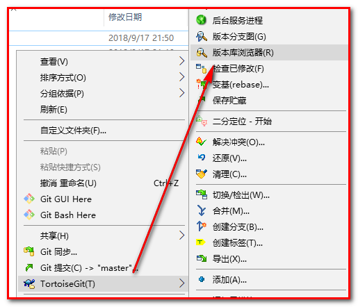

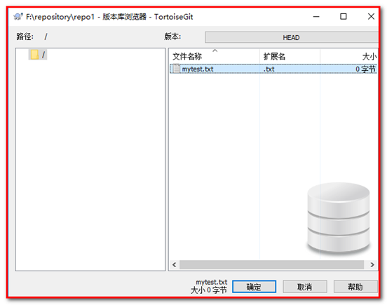

### 3.修改文件

#### 3.1提交修改

​	被版本库管理的文件不可避免的要发生修改，此时只需要直接对文件修改即可。修改完毕后需要将文件的修改提交到版本库。
​	在mytest.txt文件上点击右键，然后选择“提交”

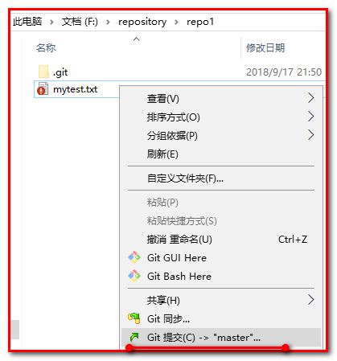

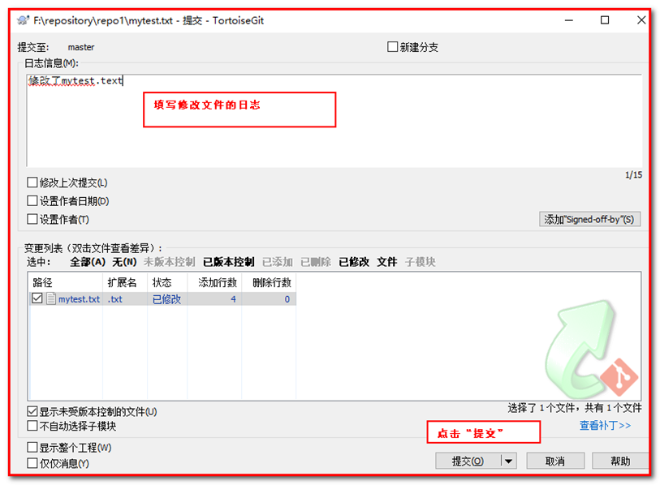

#### 3.2查看修改历史

​	在开发过程中可能会经常查看代码的修改历史，或者叫做修改日志。来查看某个版本是谁修改的，什么时间修改的，修改了哪些内容。

​	可以在文件上点击右键选择“显示日志”来查看文件的修改历史。


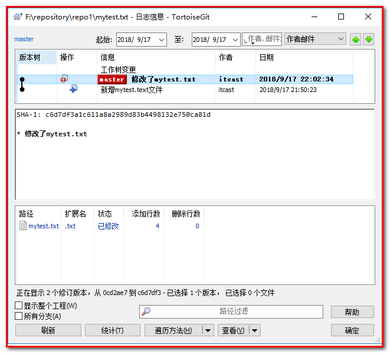

可以【导出】指定版本，如果编写错误，用于还原到历史版本。

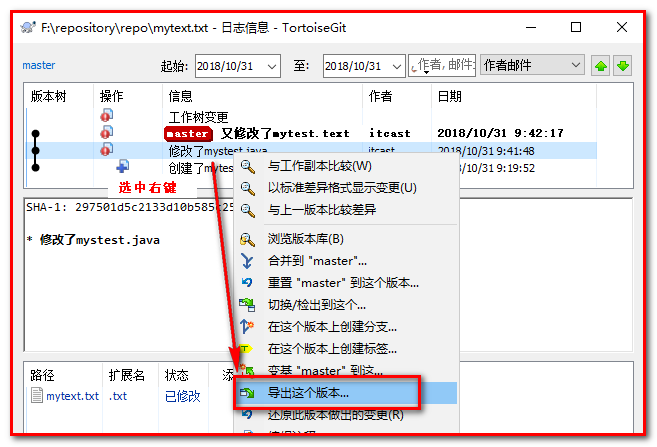

#### 3.3差异比较

当文件内容修改后，需要和修改之前对比一下修改了哪些内容此时可以使用“比较差异功能”


#### 3.4还原修改

当文件修改后不想把修改的内容提交，还想还原到未修改之前的状态。此时可以使用“还原”功能

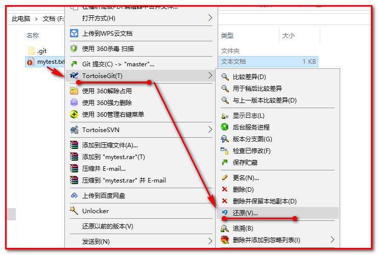

注意：此操作会撤销所有未提交的修改，所以当做还原操作是需要慎重慎重！！！

### 4. 删除文件

#### 4.1删除文件

需要删除无用的文件时可以使用git提供的删除功能直接将文件从版本库中删除。(本地和版本库都删除)


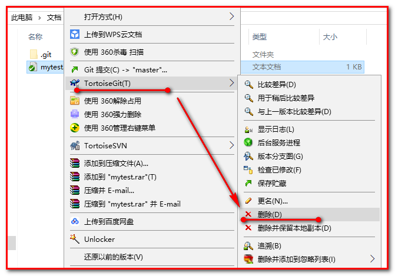

此时不是真的删除，可以通过还原功能，还原文件。

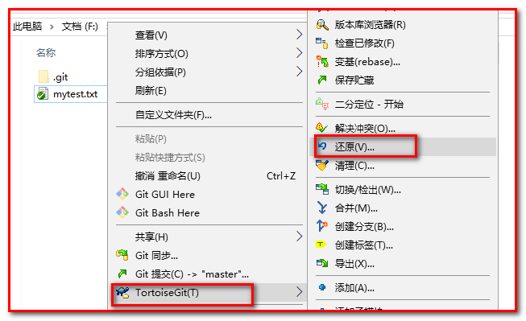

如果真的想删除文件，可以选择【提交】

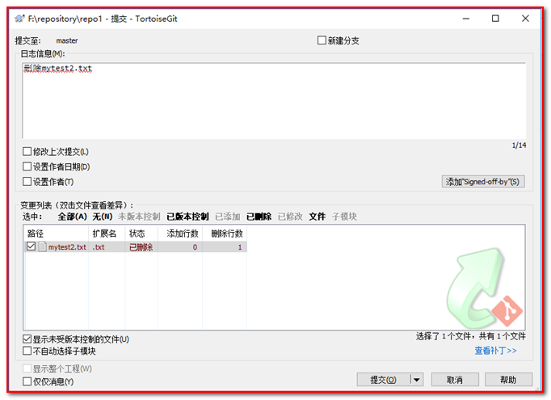


#### 4.2删除文件并保留副本

版本库删除,但是本地还存在


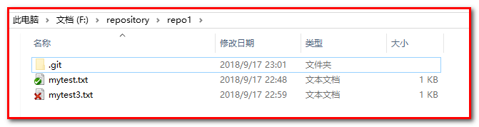

此时文件删除，但是本地参考仍然存在，执行【提交】可以删除版本库的文件，但是mytest3.txt在本地会保留。


【提交】后，查看仓库。


### 5.案例：将java工程提交到版本库

+ 第一步：将参考资料中的java工程HelloProjet复制到工作目录中


+ 第二步：将工程添加到暂存区。


​	点击确定


点击【确定】完成暂存区添加。

+ 第三步：忽略文件或文件夹

  ​	在此工程中，并不是所有文件都需要保存到版本库中的例如“out”目录及目录下的文件就可以忽略。好在Git考虑到了大家的感受，这个问题解决起来也很简单，在Git工作区的根目录下创建一个特殊的.gitignore文件，然后把要忽略的文件名填进去，Git就会自动忽略这些文件。

  如果使用TortoiseGit的话可以使用菜单项直接进行忽略。

  

   

  选择保留本地文件。完成后在此文件夹内会多出一个.gitignore文件，这个文件就是文件忽略文件，当然也可以手工编辑。其中的内容就是把.idea和out目录忽略掉。

  

  打开.gitinore文件

  

+ 第四步:提交代码

  将代码添加到master分支上，其中.gitignore文件也需要添加到暂存区，然后提交到版本库。

  

  查看版本库浏览器，不会出现.out和.idea的文件

  

  ​

## 第五章-远程仓库

### 1.添加远程仓库

​	现在我们已经在本地创建了一个Git仓库，又想让其他人来协作开发，此时就可以把本地仓库同步到远程仓库，同时还增加了本地仓库的一个备份。

常用的远程仓库就是github和国内的码云. 接下来我们演示如何将本地代码同步到github.

#### 1.1 在github上创建仓库

​	首先你得在github上创建一个账号，这个就不演示了。然后在github上创建一个仓库. 官网：[https://github.com/](https://github.com/)

+ 注册账号：


+ 登录：

  

+ 新建仓库


点击“create repository”按钮仓库就创建成功了。


​	Github支持两种同步方式“https”和“ssh”。如果使用https很简单基本不需要配置就可以使用，但是每次提交代码和下载代码时都需要输入用户名和密码（github注册的账号和密码）。如果使用ssh方式就需要客户端先生成一个密钥对，即一个公钥一个私钥。然后还需要把公钥放到githib的服务器上。这两种方式在实际开发中都有应用，所以我们都需要掌握。接下来我们先看ssh方式。

#### 1.2 ssh协议

##### 1.2.1什么是ssh协议

​	SSH 为 Secure Shell（安全外壳协议）的缩写，由 IETF 的网络小组（Network Working Group）所制定。SSH 是目前较可靠，专为远程登录会话和其他网络服务提供安全性的协议。利用SSH 协议可以有效防止远程管理过程中的信息泄露问题。

##### 1.2.2 基于密匙的安全验证

​	使用ssh协议通信时，推荐使用基于密钥的验证方式。你必须为自己创建一对密匙，并把公用密匙放在需要访问的服务器上。如果你要连接到SSH服务器上，客户端软件就会向服务器发出请求，请求用你的密匙进行安全验证。服务器收到请求之后，先在该服务器上你的主目录下寻找你的公用密匙，然后把它和你发送过来的公用密匙进行比较。如果两个密匙一致，服务器就用公用密匙加密“质询”（challenge）并把它发送给客户端软件。客户端软件收到“质询”之后就可以用你的私人密匙解密再把它发送给服务器。

##### 1.2.3 ssh密钥生成

+ 在windows下我们可以使用 Git Bash.exe来生成密钥，可以通过开始菜单或者右键菜单打开Git Bash


+ git bash 执行命令,生命公钥和私钥

```
ssh-keygen -t rsa
```


+ 执行命令完成后,在window本地用户.ssh目录C:\Users\用户名\.ssh下面生成如下名称的公钥和私钥:


##### 1.2.4 ssh密钥配置

+ 密钥生成后需要在github上配置密钥(共钥)本地才可以顺利访问。


+ 在key部分将id_rsa.pub文件内容添加进去，然后点击“Add SSH key”按钮完成配置。

  

+ 测试联通情况


在git bash中执行命令：出现上图所示的提示，再次执行一次命令 即可。

```shell
ssh -T git@github.com
```

表示连接成功。

#### 1.3使用ssh协议同步到远程仓库

##### 1.3.1 使用git bash

+ 在仓库所在的目录（F:\repository）点击右键选择“Git Bash Here”，启动git bash程序


+ 然后在git bash中执行如下语句

```
git remote add origin git@github.com:itcast888/mytest.git
git push -u origin master
```

其中:git@github.com:itcast888/mytest.git为仓库的地址(大家需要换成自己的)


+ 如果出现如下错误(没用的话请忽视)：

  


可以先执行如下命令，然后再执行上面的命令

```
$ git remote rm origin
```


+ 查看github


##### 1.3.2使用TortoiseGit同步

【注意】：首先保证：ssh客户端需配置成git使用的客户端


+ 可以重新创建一个仓库


+ 设置远端客户端仓库url


​	Url：远程仓库的地址

​	推送URL：也是相同的（可以不填写）

​	Putty密钥：选择刚才生成的密钥中的私钥

+ 右键，选择“git 同步”


+ 查看github


#### 1.3.3 使用TortiseGit 的另一种方式进行同步

上一种方式 在某种情况下由于环境的问题，可能会出现问题，那么我们使用另外一种：

1）生成.ppk文件：点击如图所示的puttygen


2）导入私钥


选择之前生成的私钥。


3）保存为ppk文件：


4）设置网络和远端：


点击添加保存。


5）创建远程仓库：

此步骤忽略，参考上一部分内容，如下远程仓库地址为：

```
git@github.com:liu654011945/def.git
```


6）创建一个本地仓库并创建文件，并提交


7）推送本地仓库到远程仓库中：


选择 刚才定义好的远程名。点击确定


刷新远程仓库页面：


#### 1.4使用http协议同步到远程仓库

+ 创建仓库mytest3


+ 选择“Git同步”

  

  


+ 这时候推送需要输入“用户名”和“密码”

  ​

  

+ 查看github

  


### 2.从远程仓库克隆

​	克隆远程仓库也就是从远程把仓库复制一份到本地，克隆后会创建一个新的本地仓库。选择一个任意部署仓库的目录，然后克隆远程仓库。创建F/repository/clone_repo目录，用来存放clone下来的项目

#### 2.1使用git bash

+ 使用远程仓库的mytest3为例：


+ 在任意目录点击右键：

!

#### 2.2使用TortoiseGi

+ 使用远程仓库的mytest3为例：


+ 在任意目录点击右键：

  

  

### 3.解决版本冲突

#### 3.1制造冲突

+ 第一步：将aaa.txt文件，并推送（push）到远程仓库mytest中。


+ 第二步：从远程仓库mytest中获取代码（pull）

  ​

  

  

我们试想一下两边同时修改了aaa.txt，会出现什么结果。

先提交，不会有问题；

后提交，会怎么样？


#### 3.2 解决冲突

其中，F:/repository/repo1中的aaa.txt先提交到本地仓库，再推送到远程仓库没有问题

而F:/repository/clone_repo1/mytest中的aaa.txt先提交到本地仓库，再推送到远程仓库的时候出现问题。如图：


这个时候，先拉取远程仓库的代码到本地。


编辑冲突：


合并成一个新的文件


再次推送，没有问题


### 4.搭建私有Git服务器

#### 4.1 服务器搭建

​	远程仓库实际上和本地仓库没啥不同，纯粹为了7x24小时开机并交换大家的修改代码。GitHub就是一个免费托管开源代码的远程仓库。但是对于某些源代码如生命的商业公司来说，既不想公开源代码，又舍不得给GitHub交保护费，那就只能自己搭建一台Git服务器作为私有仓库使用。

​	搭建Git服务器需要准备一台运行Linux的机器，在此我们使用CentOS。以下为安装步骤：

##### 4.1.1安装

+ 安装git服务环境准备，联网（3-5分钟）

```shell
yum -y install curl-devel expat-devel gettext-devel openssl-devel zlib-devel perl-devel gcc-c++
```

+ 下载 linux版本的git 这里已经提供，直接 上传至linux系统中。


+ 解压

```
[root@localhost ~]# tar -xvf git-2.9.3.tar.gz
```

+ 进入到git目录

```
[root@localhost ~]# cd git-2.9.3
```

+ 安装

```
make prefix=/usr/local all
make prefix=/usr/local install
```


##### 4.1.2创建用户

+ 添加用户(此命令执行后会创建/home/git目录作为git用户的主目录)

```
useradd git
```

+ 设置密码

```
passwd git
```

​	输入两次密码

​	密码 git

+ cd /home/git 下并切换到git用户

```
su git
```


##### 4.1.3创建git仓库

+ 创建目录

```
mkdir -p /home/git/repo01
```

+ 执行命令创建仓库

```
cd /home/git/repo01
git --bare init 
```

注意:注意：如果不使用“--bare”参数，初始化仓库后，提交master分支时报错。这是由于git默认拒绝了push操作，需要.git/config添加如下代码：

```
[receive]

      denyCurrentBranch = ignore
```

这个操作等同于：TortoiseGit中的


#### 4.2上传代码到私有仓库

+ 本地版本库推送到私有远程仓库

  

+ 填写设置 Url：ssh://git@192.168.25.129/home/git/repo01


```
解释：ssh://git@192.168.25.129/home/git/repo01

ssh:指定ssh协议
//git 指定的是用户为git
@192.168.25.129/home/git/repo01 上传远程仓库的地址

```


+ 输入密码


+ 上传之前的目录：


+ 上传之后：

  ​	


#### 4.3克隆私有仓库到本地


Url：ssh://git@192.168.25.129/home/git/repo01

## 第六章-分支管理

### 1.创建合并分支

​	在我们每次的提交，Git都把它们串成一条时间线，这条时间线就是一个分支。截止到目前，只有一条时间线，在Git里，这个分支叫主分支，即master分支。HEAD指针严格来说不是指向提交，而是指向master，master才是指向提交的，所以，HEAD指向的就是当前分支。

​	如图：只要有本地仓库就有master分支。


​	一开始的时候，master分支是一条线，Git用master指向最新的提交，再用HEAD指向master，就能确定当前分支，以及当前分支的提交点：


每次提交，master分支都会向前移动一步，这样，随着你不断提交，master分支的线也越来越长。

当我们创建新的分支，例如dev时，Git新建了一个指针叫dev，指向master相同的提交，再把HEAD指向dev，就表示当前分支在dev上：


你看，Git创建一个分支很快，因为除了增加一个dev指针，改改HEAD的指向，工作区的文件都没有任何变化！ 


理解HEAD:


不过，从现在开始，对工作区的修改和提交就是针对dev分支了，比如新提交一次后，dev指针往前移动一步，而master指针不变：


​	假如我们在dev上的工作完成了，就可以把dev合并到master上。Git怎么合并呢？最简单的方法，就是直接把master指向dev的当前提交，就完成了合并：


所以Git合并分支也很快！就改改指针，工作区内容也不变！

合并完分支后，甚至可以删除dev分支。删除dev分支就是把dev指针给删掉，删掉后，我们就剩下了一条master分支：

如图：查看分支、合并


### 2.使用TortoiseGit实现分支管理


#### 2.1分支管理

+ 在本地仓库文件夹中点击右键，然后从菜单中选择“创建分支”

 


如果想创建完毕后直接切换到新分支可以勾选“切换到新分支”选项或者从菜单中选择“切换/检出”来切换分支：


右键查看，再提交，指向新的分支。


#### 2.2合并分支

+ 如果A分支需要合并B分支, 先切换到A分支;   如果B分支需要合并A分支,先切换到B分支


解决冲突后提交即可,此时可以提交到主线上。

#### 2.3 删除分支

+ 右键选择“切换/检出”,选择分支。


## 第七章-在IntelliJ IDEA中使用git

创建一个工程


### 1.在Idea中配置git

​	安装好IntelliJ IDEA后，如果Git安装在默认路径下，那么idea会自动找到git的位置，如果更改了Git的安装位置则需要手动配置下Git的路径。

+ 选择File→Settings打开设置窗口，找到Version Control下的git选项：

 

+ 选择git的安装目录后可以点击“Test”按钮测试是否正确配置。

  

### 2.创建工程集成GIT

 创建Maven工程打包方式为jar包，并创建User类。


+ 创建本地仓库


此时样式改变，查看本地工程目录，有绿色箭头。说明创建了仓库。


+ 添加工程到暂存区


+ 提交commit


提交：样式变化：


### 3.远程仓库操作

#### 3.1推送到远程仓库

+ 在github上创建一个仓库然后将本地仓库推送到远程。创建远程仓库itcast_git


​	这里注意：我们使用https的协议，因为ssh的协议无法使用idea链接。

+ 在工程上点击右键，选择git→Repository→Remotes，

  

  


+ 在工程上点击右键，选择git→Repository→Push，


#### 3.2从远程仓库克隆

方式一：选择VCS--->Checkout from Version Control--->GitHub

 

方式二：或者：关闭工程后，在idea的欢迎页上有“Checkout from version control”下拉框，选择git


+ 此处仍然推荐使用https形式的url，


+ 拉取成功


#### 3.3push到远程仓库

+ 修改User
+ 先commit到本地


+ 再push到远程

  


#### 3.4从远程仓库pull


### 4.在Idea中使用分支

+ 我们选择VCS--->Git--->Branches，


+ 我们点击“New Branch”，新建一个分支


+ 分支操作


## 附录

### 1.忽略文件（.gitignore）语法规范

https://github.com/github/gitignore

空行或是以# 开头的行即注释行将被忽略。

可以在前面添加正斜杠 / 来避免递归,下面的例子中可以很明白的看出来与下一条的区别。

可以在后面添加正斜杠 / 来忽略文件夹，例如build/ 即忽略build文件夹。

可以使用! 来否定忽略，即比如在前面用了*.apk ，然后使用 !a.apk ，则这个a.apk不会被忽略。

\* 用来匹配零个或多个字符，如 *.[oa] 忽略所有以".o"或".a"结尾， *~ 忽略所有以 ~ 结尾的文件（这种文件通常被许多编辑器标记为临时文件）； [] 用来匹配括号内的任一字符，如 [abc] ，也可以在括号内加连接符，如 [0-9] 匹配0至9的数； ? 用来匹配单个字符。 

看了这么多，还是应该来个例子：

```
# 忽略 .a 文件
*.a
# 不忽略 lib.a, 尽管已经在前面忽略了 .a 文件
!lib.a
# 仅在当前目录下忽略 TODO 文件， 但不包括子目录下的 subdir/TODO
/TODO
# 忽略 build/ 文件夹下的所有文件
build/
# 忽略 doc/notes.txt, 不包括 doc/server/arch.txt
doc/*.txt
# 忽略所有的 .pdf 文件 在 doc/ directory 下的
doc/**/*.pdf
```

