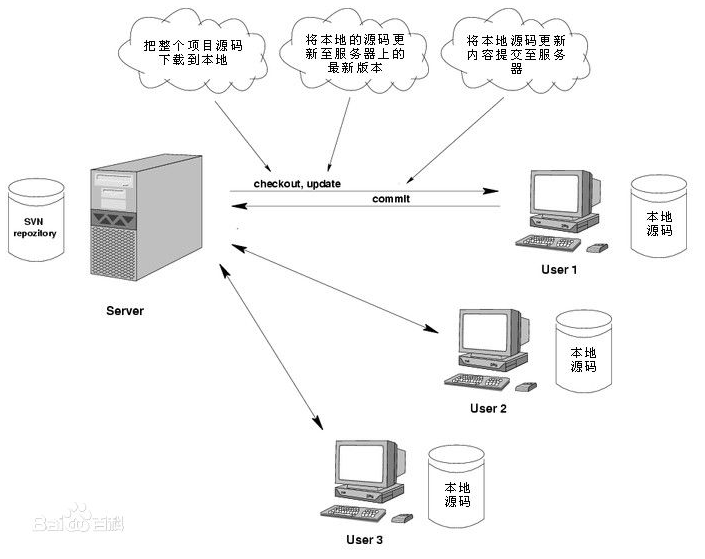
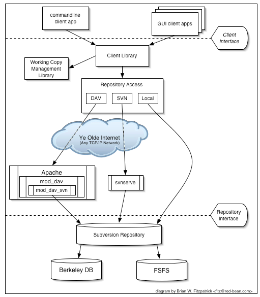
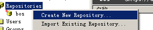
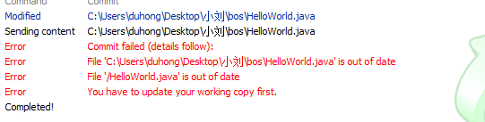
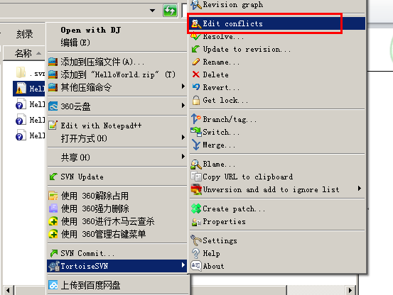
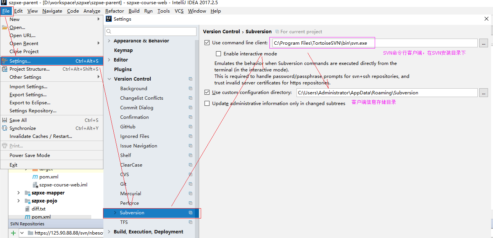
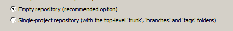
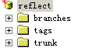

# SVN


### 第1章 SVN相关的概念

#### 1.1 SVN 介绍

SVN是Subversion的简称，是一个自由开源的版本控制系统。

Subversion将文件存放在中心版本库里，这个版本库很像一个普通的[文件服务器](http://baike.baidu.com/view/566090.htm)，不同的是，它可以记录每一次文件和目录的修改情况，这样就可以借此将[数据恢复](http://baike.baidu.com/view/185060.htm)到以前的版本，并可以查看数据的更改细节

早期版本控制使用的是CVS,后来SVN替代了CVS,随着android兴起，出现Git版本控制工具，后续我们会学到。


#### 1.2 SVN基本概念

 

问题: 怎样让系统允许用户共享信息，而不会让他们因意外而互相干扰？

**复制-修改-合并方案(Subversion默认的模式) **

在这种模型里，每一个客户读取项目配置库建立一个私有工作副本——版本库中文件和目录的本地映射。用户并行工作，修改各自的工作副本，最终，各个私有的复制合并在一起，成为最终的版本，这种系统通常可以辅助合并操作，但是最终要靠人工去确定正误。

**锁定-修改-解锁方案 **

在这样的模型里，在一个时间段里配置库的一个文件只允许被一个人修改。 此模式不适合软件开发这种工作。


#### 1.3 SVN架构



Subversion支持[Linux](http://baike.baidu.com/view/1634.htm)和[Windows](http://baike.baidu.com/view/4821.htm)，更多是安装在Linux下。

svn服务器有2种运行方式：[独立服务器](http://baike.baidu.com/view/2106199.htm)和借助[apache](http://baike.baidu.com/view/28283.htm)运行。两种方式各有利弊，用户可以自行选择。

svn存储版本数据也有2种方式：[BDB](http://baike.baidu.com/view/1303712.htm)(一种[事务](http://baike.baidu.com/view/121511.htm)安全型表类型)和[FSFS](http://baike.baidu.com/view/1633161.htm)(一种不需要数据库的[存储系统](http://baike.baidu.com/view/51839.htm))。

因为BDB方式在服务器中断时，有可能锁住数据，所以还是FSFS方式更安全一点。


### 第2章 SVN的安装和使用

#### 2.1 服务器端VisualSVN安装与配置

##### 2.1.1 VisualSVN下载

下载地址：https://www.visualsvn.com/server/download/


根据你的操作系统，选中不同的安装包，我们这里选择64位安装包。我们这里下载了最新版本的SVN，在第1天的资料/svn资料/01svn服务器端软件/VisualSVN-Server-3.9.2-x64.msi 。如果想使用，直接双击安装即可，安装不步骤我们接下来会继续介绍。


##### 2.1.2 VisualSVN安装与创建仓库

双击刚才下载的SVN服务端软件VisualSVN-Server-3.9.2-x64.msi，安装如下步骤安装。

###### 第1步：双击安装，选next


###### 第2步：勾选统一协议并next


###### 第3步：勾选安装服务和工具并选next


###### 第4步：选standard edition标准版本安装


###### 第5步： 选中安装路径和仓库路径

如下图，大家可以选择Repositories的路径，用于存放文件数据，不建议放在C盘，因为C盘一般有权限问题。Server Port为SVN服务端占用的端口号，默认是443，如果本地经存在使用了443端口的程序，可以将它停掉，或者把Server Port选项换成其他端口都可以。


小技巧：

查看端口占用方法：cmd进入dos命令行，输入netstat -ano  "443"  回车,其中PID是进程号。


任务管理器中查看进程号：


###### 第6步： 选择install安装


点击install后进入安装界面，如下图：


###### 第7步： 安装完成


点击Finish后，进入SVN服务端的管理可视化图形界面，如下图：


在开始运行中录入 services.msc，然后回车


我们可以看到有VisualSVN Server这个服务，默认已经在开启运行，只要它开启了，就能使用SVN服务端，即便上面管理界面没有打开也能使用。


#### 2.2 VisualSVN创建工程目录

##### 2.2.1 创建一个仓库

在Repositories上右键 -> Create New Repository





上面选中Create New Repository后会弹出如下窗口，我们选中Regular FSFS repository，并点击下一步.

这里表示使用的存储模式为文件系统（咱们的操作系统windows）存储，大家上传的文件就会存到硬盘中。


我们给自己仓库取个名字，叫ssm，然后点击下一步，这里根据个人公司项目名字来定义，不一定非得叫ssm。


我们只需要创建一个空仓库即可，这里选择第一个，然后选择下一步。第一个选项表示创建一个空仓库，第二个选项一会再详细讲解。


为当前仓库配置访问权限信息，为了方便测试，我们选中间那个，让所有svn账号都能链接并读写。


至此，完成了仓库的创建，点击Finish。


Repository URL(仓库地址): https://DESKTOP-79U5AQM/svn/ssm/


如下图：


##### 2.2.2 VisualSVN 权限控制

###### 2.2.2.1 创建用户

用户用于链接SVN服务端，就像程序链接数据库需要账号密码一样。

选择Users -> Create User


创建账号和账号对应的密码，然后点击OK，如下图：


此时多了个用户账号


###### 2.2.2.2 创建组

一个公司可能会存在多个项目，每个项目可能由不同的人员开发，为了方便管理，我们SVN里面提供了人员分组管理，可以创建一个分组，指定分组的人员信息以及分组人员的权限信息。

选择Groups -> Create Group


输入组名


为组分配人员

我们可以店家add为该组添加组员，可以点击remove将该组中的成员从组中移除。


###### 2.2.2.3 分配权限

有时候我们有些目录不希望所有人都能访问，而只希望指定人员能访问，就需要给指定目录设置访问权限了。

选中ssm(对应的仓库目录) -> Properties


会弹出如下界面，点击add，可以添加某个账号的权限。


#### 2.3 客户端TortoiseSVN安装与使用

TortoiseSVN是一个基于windows系统的svn客户端图形化界面.

下载地址：https://tortoisesvn.net/downloads.html


##### 2.3.1 Tortoise SVN下载

访问后，会有如下界面，我们点击for 64-bit os下载。在我们资料/svn资料/02svn客户端软件目录下已经提供了下载好的安装文件 ： TortoiseSVN-1.11.0.28416-x64-svn-1.11.0.msi


##### 2.3.2 Tortoise SVN安装

把上面准备好的安装文件TortoiseSVN-1.11.0.28416-x64-svn-1.11.0.msi 点击安装。

选中Next


选中Next


此时这里有一个x，这里先不要点击下一步，先把x这里处理一下，看下面步骤。


处理x：点击x旁边的下箭头，展开选第1个，再点Next。这里选中第1个表示安装SVN命令行到本地硬盘中。


点击install，安装SVN客户端


点击Finish即可


安装后在电脑任意目录或者桌面，点击鼠标右键会有如下SVN相关图标，如果没有，重启下电脑即可。


#### 2.4 Tortoise SVN 常用操作

##### 2.4.1 浏览仓库

创建一个文件夹 svn，在文件夹中右键 -> tortoiseSVN -> Repo-browser   就可以浏览当前SVN仓库信息。


点击Repo-browser后，需要输入要浏览的SVN仓库地址,该地址为2.2.1中创建仓库完成后的那个地址。


点击OK后会弹出窗口输入账号密码才能浏览


当然，目前仓库里没有内容，所以浏览的时候，也是空的。


##### 2.4.3 checkout 检出SVN服务器项目

如果我们想将服务器上的项目检出(可以直接理解成下载)到本地，可以使用SVN的checkout功能。

在刚才新建的svn目录右键 -> checkout


此时需要填写检出信息，如下图：


点击ＯＫ即可,此时本地的svn目录下会多一个隐藏文件.svn文件，注意：这个文件是隐藏文件夹，需要勾选隐藏的项目才能看到。由于咱们SVN上目前没有任何东西，所以从服务商检出的内容也没有什么。


##### 2.4.3 add

我们在刚才本地创建的svn目录中新建一个demo/Hello.java文件，然后在文件中输入一些东西。测试的demo文件夹如下图：


此时表示文件没有被SVN管理，选择demo，在它上面点击右键 TortoiseSVN -> +add


会弹出如下窗口，点击OK


点击OK后会弹出如下检出的操作信息，再点击OK即可。


这时候文件就会发生变化，它身上有一个蓝色的+号，表示文件此时被SVN管理了。


##### 2.4.4 commit

刚才demo文件夹并不表示上传到了svn，只是表示它被svn管理了，我们需要commit提交才能上传到服务器去。在该目录下点击鼠标右键  ->  Svn Commit


 会弹出窗口让你选择提交内容和填写备注，如下图：


点击OK就会向服务器上传文件。


##### 2.4.5 update

Update，它是更新操作,可以将svn服务器上的内容更新到本地，在刚才svn目录鼠标右键 -> SVN Update


会弹出窗口，到服务器上下载更新过的内容


##### 2.4.6 更新到历史版本

查看当前日志


可以看到该文件的历史信息


也可以通过下面的方式来更新历史版本


此时文件会恢复到你所选择的版本


##### 2.4.7 delete

标记删除操作，本地文件会删除，我们需要进行提交，才能真正从服务器删除

先选中文件右键 TortoiseSVN -> Delete


删除后记得在该目录下右键 SVN Commit，这样文件才会被删除。


此时服务器上就删除了。


##### 2.4.8 导入与导出

导入导出功能，主要针对的是该目录文件夹不属于svn文件夹，将服务器上的文件导出到本地，本地并不会生成.svn文件夹，本地东西上传到服务器去，本地也不会有.svn文件夹。

导出：在一个非svn的目录下右键TortoiseSVN -> Export


会将服务器上的文件导出到本地


导出过程如下：


Export导出项目，和checkout的区别,它不存在.svn隐藏文件


导入：在需要导入文件到服务器的目录(非SVN目录)右键 -> TortoiseSVN -> Import


会弹出如下窗口，填写备注信息点击OK即可。


##### 2.4.9 冲突问题与解决

多个用户同时操作同一个文件时，就可能产生冲突情况。\



这个冲突产生后如何解决，我们可以采用手动Merge,解决冲突后，重新commit.


HelloWorld.java 它是服务器上的文件与本地文件合并

HelloWorld.java.mine 本地修改后的文件

HelloWorld.java.r4 修改前的文件

HelloWorld.java.r5 对方修改后的文件




### 第3章 客户端IDEA SVN 插件安装与使用

#### 3.1下载与安装svn插件

选择File>Version Controller>Settings>Subversion,分别设置命令行客户端工具和svn配置信息存储目录。如下图：




#### 3.2 IDEA SVN插件使用

##### 3.2.1 浏览仓库

选中IDEA工具栏的VCS > Browse VCS Repository > Browse Subversion Repository


此时会出现如下界面，我们点击+号，输入本地SVN地址，再点击OK即可将本地SVN地址加入进来。


这时候的界面如下，需要我们输入正确的账号和密码方能实现仓库浏览。


账号密码正确后，如下浏览：


##### 3.2.2 checkout 导入 导出

打开上面浏览的SVN目录信息，并选中任意一个项目，并右键，选中checkout，该功能是将SVN上的资源检出到本地。


选中本地目录，用于存储从SVN服务器上检出的项目，目录选中后，直接点击OK，进入版本选择和存储目标地址选中


接着我们选中要检出的项目存储目标地址，并选中要检出的版本信息，最后点击OK即可。


这里我们直接勾选第一个，从现有资源创建项目。


这里我们要正确填写项目名字和存储目录再点击next，然后一路next，最后选择finish即可完成项目的导出。


##### 3.2.3 add commit update

在IDEA中，将本地项目共享到SVN，这个操作比较简单。

确保SVN功能已经开启：VCS > Enable Version Controller Integration


选中Subversion，此时功能的颜色会变成黄色，表明SVN功能已经开启。


共享操作：在工程上右键 > Subversion > Share Directory


选择要共享的目标SVN地址，接着指定要共享的目标对象，点击Share之后，会在SVN创建一个对应的版本库文件，但该项目并未立刻提交。


提交对应工程：选择对应工程 > Subversion > Commit Directory


勾选要提交的内容，并填写上提交内容的注释信息，然后点击commit提交，提交完成后，项目就会被提交到SVN


如果文件有修改，在项目上或者修改的文件上点击Subversion > Commit File


选择要提交的内容，并填写上注释，然后选中commit即可。


如果需要更新服务器上的文件，选中要更新的项目并右键 > Subversion > Update Directory


一般直接点击OK即可，但如果需要选择历史版本，则勾上HEAD选项。


##### 3.2.4 解决冲突

多个用户同时编辑一个文件并都直接执行提交时，容易导致冲突产生，如下：


产生了冲突 
我们在工程上执行更新操作，如果文件变更发生冲突，会看到如下界面，这里会有三个选项：

Accept Yours：接受你的版本,会以自己的版本为正确版本。

Accept Theirs：接受SVN上的版本，会把服务器的版本作为正确版本。

Merge：合并，需要将冲突手动排除后再提交。


### 第4章 SVN高级

本章节主要介绍我们在真实开中svn使用，例如 合并、分支、标记等。

#### 4.1 SVN目录规范

在visualSVN中创建仓库时，可以选择svn目录结构





Trunk 主干目录，此目录下的文件为基准文件

Branches 用于开发的分支目录

Tags 用于发布的版本目录 

假设有一个项目OA,我们完成了1.0版本，这时就可以打一个tags

后续我们在OA项目上添加一个新的模块(及时通讯),我们就可以开一个分支,又有一个公司需要在我们OA基础上添加财务管理模块，我们又可以打一个分支。 

我们后续针对OA的1.0版本在升级，我们不需要原来附加功能,就可以在原来的主干上继续开发，形成OA2.0版本，开发完成后就可以在打一个tags


#### 4.2 新建仓库

为了实现一次主干项目、分之项目、项目标签操作，我们再新建一个仓库。

选中Repositories -> Create New Repository


选FSFS存储方式


新建仓库名字


选中创建具有主干分之和标签的仓库


允许所有用户读写该仓库


#### 4.3 分支与标记

##### 4.3.1 创建主干

创建主干，只需要将项目提交到主干路径即可。

首先将服务器上的主干、分支、标记路径全部加入进来。


将主干项目提交到trunk下面。


此时服务器上就存在主干项目了。


##### 4.3.2 创建标记

创建标记比较简单，选中需要创建标记的项目，右键 Subversion > Branch or Tag


将本地工程作为要标记版本的工程，所以选中Working  Copy，标记到tags中，下面选中Any Location，浏览选中tags地址，名字记得修改一下，名字修改有一定规则，为了方便，我们直接加个v1即可。


选中文成后，此时无服务会多处一个标记工程


Tags的定义规则

```
Project name+版本号
版本号定义为三段数字编号
xxx.xxx.xxx
第一个:革命性的产品升级版
第二个:新功能版
第三个:修正bug
```

#####4.3.3 创建分支

创建分支和创建标记一样，只需要修改路径即可。


分支的定义规则:

```
Project name+日期时间+功能点
```


##### 4.3.4 切换主干，分支与标记

切换主干或者分支，选择 VCS > Update Project


根据需要，选择需要切换的工程即可。


Tags一般是只读，它代表的是发布的版本，所以我们不要进行改变。


#### 4.4 主干与分支的合并

如果要将主干内容合并到分支上，我们需要在分支的工作副本上操作。

如果要将分支的改变合并到主干上，我们需要在主干的工作副本上操作。 

我们将分支合并到主干上，首先按照上面步骤切换到分支上，再按如下操作：

选择VCS > Integrate Project


如下界面，直接点击OK即可看到主干更改合并到了分支。


注意:在合并时要选择在相应的版本号，合并后，可能会出现冲突，将冲突解决，commit就可以

